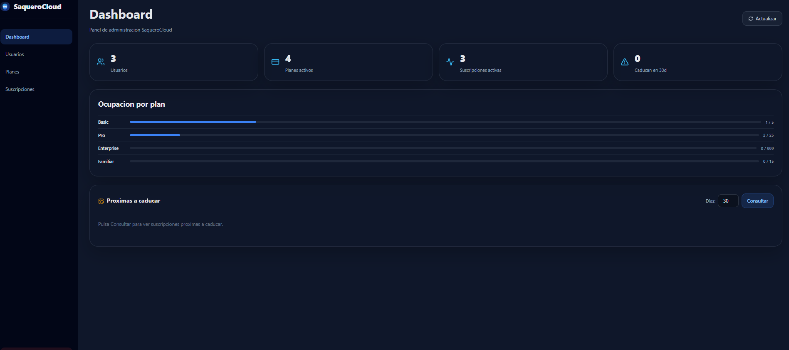
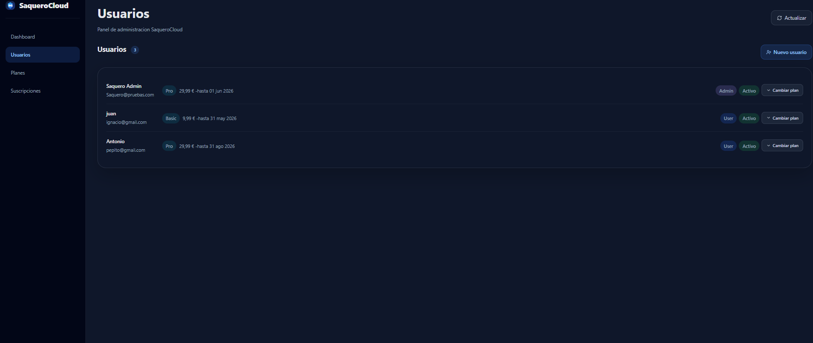
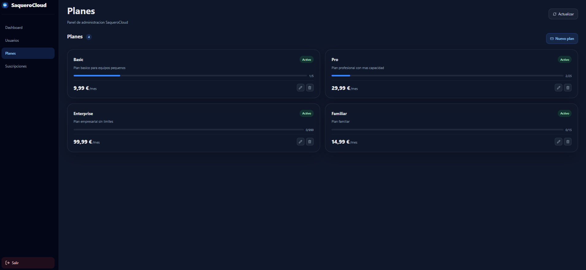
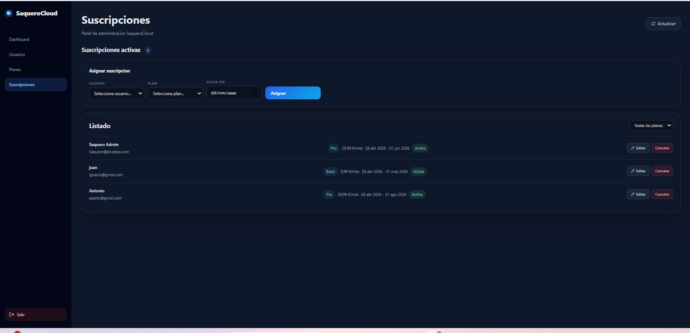

<p align="center">
  
</p>

<h1 align="center">☁️ SaqueroCloud</h1>

<p align="center">
  SaaS Admin Platform for managing users, subscription plans and billing lifecycle
</p>

---

<p align="center">


</p>

---

## 🚀 What is SaqueroCloud?

SaqueroCloud is a full stack SaaS-style admin platform built with **ASP.NET Core (.NET 8)** and **React**.

It simulates a real-world subscription system where administrators can manage:

- Users 👤  
- Subscription plans 📦  
- Active subscriptions 🔄  
- Billing lifecycle 💳  

---

## 📸 Preview

### 📊 Dashboard


### 👤 Users


### 📦 Plans


### 🔄 Subscriptions


---

## 🧠 Key Features

✔ JWT Authentication  
✔ Role-based access control  
✔ User management  
✔ Subscription plan management  
✔ Assign & cancel subscriptions  
✔ Filter subscriptions by plan  
✔ Expiring subscriptions tracking  
✔ REST API + Swagger  
✔ Full React admin dashboard  

---

## 🛠️ Tech Stack

### 🔙 Backend API
- C#  
- ASP.NET Core (.NET 8)  
- Entity Framework Core  
- JWT Authentication  
- Swagger  

### 🖥️ Frontend
- React  
- Vite  
- Axios  
- CSS (SaaS UI)  

### ⚙️ Tools
- Git  
- PowerShell  
- Swagger  
- REST Client  

---

## 📦 Setup

### Backend

```bash
cd SaqueroCloud.API
dotnet run --urls="http://127.0.0.1:5000"
Frontend
cd saquerocloud-frontend
npm install
npm run dev
🔐 Credentials
Email: Saquero@pruebas.com
Password: Admin1234!
🔗 API Endpoints
Auth
POST /api/Auth/login
POST /api/Auth/register
Users
GET /api/Users
Plans
GET /api/subscription-plans
Subscriptions
POST /api/Subscriptions/assign/{userId}
PATCH /api/Subscriptions/{id}/cancel
💡 Why this project?

This is not just a CRUD.

It demonstrates:

✔ Real SaaS architecture
✔ Business logic implementation
✔ Full stack integration
✔ Production-style API design
✔ Admin dashboard workflows

🚀 Future Improvements
Deploy (Vercel + Render)
Add tests
Add refresh tokens
Improve UI animations
Add analytics dashboard
⭐ Support

If you like this project:

👉 Give it a star
👉 Fork it
👉 Use it as a base

📬 Contact

Created by Manu Saquero

<p align="center">
  <a href="https://linkedin.com/in/manusaquero">
    
  </a>
  <a href="mailto:manusaquero@gmail.com">
    
  </a>
  <a href="https://github.com/Saquero">
    
  </a>
</p>